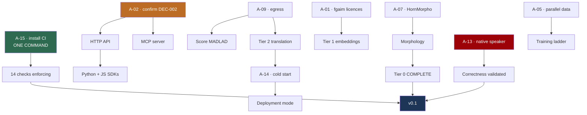

# Readiness Plan — from here to a platform people can build on

| Field | Value |
| --- | --- |
| **Status** | **Plan of record**, 2026-08-19 |
| **Supersedes** | The horizon documents (`30_days` … `2_years`) as the *execution* plan. They were written before any research and remain useful as direction, not sequence |
| **Basis** | 24 decisions, 6 experiments, 2 built packages, 2 audits |

---

## 1. What "ready" means

The word is doing a lot of work, so it gets defined before anything is planned
against it. **Three levels, each with an exit test that can be run.**

### v0.1 — *Honest and usable*

Someone outside this project can install it, call it, get correct Tigrinya
output, and know what they are getting.

| Exit criterion | Test |
| --- | --- |
| Tier 0 complete | `normalise`, `tokenize`, `transliterate`, **`morphology`** all implemented |
| **A native speaker has validated the output** | Signed-off sample; error rate recorded |
| Every capability has a metric | `metrics.md` has no `TBD` in an MVP row |
| Rules enforce themselves | CI installed and green on a real runner |
| Licensing clean | Every adopted artefact has a verified licence |
| Install-to-first-call | A stranger runs it from the README in under 5 minutes |

### v0.5 — *Serving*

| Exit criterion | Test |
| --- | --- |
| HTTP API and MCP server | Both implement DEC-022's contract |
| Deployed | Reachable, with a measured cold start (closes A-14) |
| Tier 1 embeddings | Built and evaluated |
| At least one model scored | MADLAD through the harness on real FLORES+ |
| SDKs | Python + JavaScript, offsets handled correctly |

### v1.0 — *Infrastructure*

Others build on it: stable contract, versioning policy, a real evaluation suite,
and enough adoption that breaking changes are a genuine cost.

**We are at roughly 40% of v0.1.** Two of four Tier 0 capabilities, an
evaluation harness nothing has been run through, and zero native-speaker
validation.

---

## 2. Where we actually are

**Built and tested:** `services/primitives` (normalisation, tokenization,
transliteration), `services/evaluation` (chrF/BLEU + six intrinsic checks),
103 tests, 6 experiments reproducing.

**Not built:** morphology (stub), embeddings, translation serving, HTTP API,
MCP server, SDKs, any deployment.

**Never done:** a native speaker has never looked at our output. No model has
ever been scored. CI has never run.

### The five gaps that actually matter

| # | Gap | Why it is severe |
| --- | --- | --- |
| **G-1** | **No native-speaker validation** | Every intrinsic check catches *broken*, not *wrong*. A transliterator returning confidently incorrect phonemes passes all six. **We are building Tigrinya infrastructure with no Tigrinya speaker in the loop** |
| **G-2** | **14 checks enforce nothing** | CI is written and locally verified but not installed. Two audits found **five checks that could not fail** — nothing would catch them re-breaking |
| **G-3** | **Evaluation anchors are hollow** | One of DEC-005's two anchors is unusable (TiQuAD: contaminated, no public test set, unresolved copyright); the other is a **30-sentence sample** |
| **G-4** | **Nothing has been measured end to end** | MADLAD's quality is assumed. Tier 2 cold start is assumed. The whole translation tier rests on numbers nobody has produced |
| **G-5** | **The MVP is incomplete by its own definition** | DEC-006 names morphology in the minimum platform. It is a deliberate stub |

---

## 3. The dependency graph

Most work is gated on a person, not on engineering. **The graph matters more
than the list**, because it shows which single actions unlock the most.



**Read the graph for leverage, not for order.** `A-15` is one command and
switches on everything already built. `A-13` is the only path to correctness and
has no substitute — no amount of engineering replaces a speaker.

---

## 4. Phase 0 — Unblock (this week, mostly not me)

Ordered by **leverage per minute of your time.**

| # | Action | Your effort | Unlocks |
| --- | --- | --- | --- |
| **0.1** | **A-15 — install CI** | **One command** | 14 checks; makes every rule self-enforcing |
| **0.2** | **A-02 — confirm DEC-002** | Read a 3-min summary, decide | The entire API/MCP/SDK surface |
| **0.3** | **A-01 — email `fgaim`** | Send a drafted email | Tier 1, and DEC-003's reuse plan |
| **0.4** | **A-05 — email re parallel data** | Send a drafted email | The training ladder; 1.4M sentences |
| **0.5** | **A-13 — find a Tigrinya speaker** | Ask around; **~25 min of their time** — sheets are built and ready | **G-1 — the correctness gap** |
| **0.6** | **A-09 — a session with egress** | Config change | Every model measurement |
| **0.7** | A-07 — HornMorpho licence | One email | Morphology, completing Tier 0 |

```bash
# 0.1 — do this one first
mkdir -p .github/workflows && git mv ci/verify.yml .github/workflows/verify.yml
git commit -m "Activate CI verification workflow (DEC-018)" && git push
```

**A-03, A-04, A-06, A-08, A-10, A-11, A-16** are lower priority and can run in
parallel whenever convenient. A-16 (reporting the epitran behaviour upstream) is
courtesy; A-03 (reporting the TiQuAD contamination) is an ecosystem obligation
we have been sitting on.

### A-13 is ready to send

**Widened and built, 2026-08-19.** A-13 used to be scoped to a variety audit of
the evaluation anchors, which was too narrow, and it had no instrument. Both are
fixed: send `validation/PROTOCOL.md` and `validation/sheets/` — **134 items,
about 25 minutes.**

| Sheet | What it settles |
| --- | --- |
| **1 · which is right** | **The word-final `ɨ`.** Experiment 005 found two forms differing on 4.53% of tokens and could not tell which is correct → **DEC-025** |
| 2, 4 · readings | Are the phonemes right at all? DEC-007 records that we cannot detect systematic `tir-Ethi` errors |
| 3 · spelling variants | Does collapsing ፀ→ጸ read as a **correction** of how someone chose to write? |
| 5 · variety | Eritrean, Ethiopian, or mixed — the original scope, testing DEC-010 |

⚠️ **Never send `validation/key.json`** — it records which option is ours, and
sheet 1's design depends on the reviewer not knowing. Our form sits in position
1 for 11 items and position 2 for 14, so position carries no signal either.

**If they have only ten minutes, sheet 1 is the one.** It answers a question
nothing else can, and the answer changes shipped code.

**Offer to pay.** Expert judgement in a low-resource language is scarce and
routinely extracted for free.

---

## 5. Phase 1 — Correctness foundation (blocked on A-13)

**Nothing should ship user-facing before this.** DEC-007 says so explicitly:
*"Native-speaker validation is required before anything ships user-facing."*

| Step | Deliverable | Exit criterion |
| --- | --- | --- |
| ~~1.1~~ | ~~Validation set~~ ✅ **DONE** — `validation/sheets/`, **134 items** in 5 strata, deterministic | Reproduces byte-identically across hash seeds |
| ~~1.2~~ | ~~Review protocol~~ ✅ **DONE** — `validation/PROTOCOL.md` + `analyse.py` | Constrained vocabularies; forced choice with the answer hidden |
| 1.3 | **Measured accuracy** for transliteration and normalisation | A number in `metrics.md`, replacing "intrinsic only" |
| 1.4 | **Resolve the `ɨ` question** → DEC-025 | Decision recorded, `transliterate.py` updated if it changes |
| 1.5 | **Variety audit** of E-01 and any TiQuAD sample | DEC-010 confirmed as precaution or upgraded to live correction |

**1.1 and 1.2 are built** (2026-08-19). A-13 is no longer "find someone and work
out what to ask" — it is "send these five sheets to a speaker." Everything from
1.3 down now waits on one person's ~25 minutes.

---

## 6. Phase 2 — Complete Tier 0 (blocked on A-07)

| Step | Deliverable | Notes |
| --- | --- | --- |
| 2.1 | HornMorpho licence resolved, or an alternative chosen | If refused: `fgaim` POS models (**A-01**) or accept a documented gap |
| 2.2 | `morphology.py` implemented behind the existing stub API | `is_available()` already exists so callers degrade gracefully |
| 2.3 | **Intrinsic checks extended to morphology** | Consistency, coverage, determinism — the `metrics.md` row corrected in the audit stays ❌ until this lands |
| 2.4 | Gold data for morphological accuracy | The **one** capability DEC-023 could not free from annotation |

⚠️ **Do not repeat the metrics.md error.** That row claimed morphology was
validated citing an experiment that never tested it. It stays ❌ until a
measurement exists.

---

## 7. Phase 3 — The surface (blocked on A-02)

| Step | Deliverable | Notes |
| --- | --- | --- |
| 3.1 | Endpoint surface designed → DEC-026 | The *contract* is already decided (DEC-022); only the surface is open |
| 3.2 | HTTP API over the libraries | **Thin wrapper** — DEC-012 forbids capability logic behind a network call |
| 3.3 | `warmup()` at boot | Lazy loading defers 3.03 s onto the first caller |
| 3.4 | Contract conformance tests | Every DEC-022 clause asserted — the `tier` clause was decided and silently unimplemented for 16 days |
| 3.5 | MCP server, same libraries | Uncertainty must be **structurally** visible: a model cannot evaluate Tigrinya, and neither can its reader |
| 3.6 | Python + JS SDKs | **JS must handle the UTF-16 divergence** — Extended-B is above the BMP |
| 3.7 | Versioning policy | Cheap now, expensive once consumers exist |

---

## 8. Phase 4 — Tiers 1 and 2 (blocked on A-01, A-09)

| Step | Deliverable | Notes |
| --- | --- | --- |
| 4.1 | **Design embeddings evaluation** | `tiroberta-bi-encoder` is **monolingual**, so FLORES+ bitext retrieval does not apply. This is genuinely unsolved and needs research, not just building |
| 4.2 | Tier 1 built and evaluated | |
| 4.3 | **Score MADLAD-400-3B** through the harness | Closes **G-4**. Report chrF primary with intervals, variety-scoped |
| 4.4 | Convert to CTranslate2 int8 (DEC-014) | |
| 4.5 | **Measure Tier 2 cold start** → closes A-14 | Experiment 006's method applies unchanged; only the model is missing |
| 4.6 | Deployment mode from measured duty cycle | DEC-019 states the rule; A-14 supplies the number |

⚠️ **If MADLAD underperforms, A-05 is the only remedy** — and it is an email
sent months earlier or not at all. That is why 0.4 is in Phase 0.

---

## 9. Phase 5 — Ship

| Step | Deliverable |
| --- | --- |
| 5.1 | Deployment target chosen (needs A-14 + A-02) |
| 5.2 | Container images, sized against the 3.03 s cold start |
| 5.3 | Monitoring — **cheapest adequate**, not most complete |
| 5.4 | Install-to-first-call path, tested on someone who has never seen the repo |
| 5.5 | Release and versioning; the project is unversioned until a service deploys |
| 5.6 | Announce to GeezLab / L3S (**A-10**) — the ecosystem contribution |

---

## 10. Cross-cutting debt

Small, unblocked, and worth clearing between phases.

| Item | Effort | Why |
| --- | --- | --- |
| Audit `docs/vision`, `docs/roadmap`, `docs/research/references` | Half a day | The last three unaudited trees. Every audited tree has produced real defects — including this README's "Licence: Not yet selected" |
| Reconcile the horizon roadmaps with reality | Short | `30_days.md` still lists completed research as upcoming |
| Retire duplicate `is_ethiopic` / `normalise` definitions | Short | Three copies of one; the audit found one wrong. They agree **today** |
| Contract conformance test suite | Short | Generalises the `tier` fix — assert every clause, not the ones we remember |
| `tigrinya_eval` used by an experiment | Short | The harness is tested but no experiment consumes it, so drift is possible |

---

## 11. Risks that would invalidate this plan

| Risk | Impact | Mitigation |
| --- | --- | --- |
| **No Tigrinya speaker is found** | **Severe** — v0.1 is unreachable; the project can never claim correctness | Start now; it has the longest lead time of anything here |
| A-01 refused | Tier 1 loses its model | Alternatives exist but are weaker; the gap-filling strategy survives |
| A-05 refused | Training ladder permanently blocked | MADLAD must then be good enough as shipped |
| MADLAD is poor at Tigrinya | Translation tier fails | Unknown until 4.3. **This is the single largest unmeasured assumption** |
| Egress stays blocked | 4.3–4.5 impossible | Everything else can proceed; translation cannot |
| CI never installed | The whole verification apparatus is decorative | One command |

---

## 12. What I can do without you, starting now

**In priority order**, all unblocked:

1. **Build the native-speaker validation set and review protocol** (1.1, 1.2).
   Highest value: it converts A-13 from "find someone" into "send them this."
2. **Audit the last three doc trees.** Every previous audit found real defects.
3. **Contract conformance tests** — generalise the `tier` fix.
4. **Reconcile the horizon roadmaps** with what actually happened.
5. **Design embeddings evaluation** (4.1) — research, not building; the
   monolingual problem is real and unsolved.

**What I cannot do:** send an email, install the workflow, confirm a user model,
obtain a licence, reach a blocked host, or read Tigrinya as a speaker. Six of
the seven Phase 0 items are yours, and they gate almost everything else.

---

## 13. Honest assessment

**The research is unusually solid** — measured rather than cited, with three
recorded cases where measurement overturned a claim the project had already
written down. The engineering discipline is real: five checks that could not
fail were found *by deliberately trying to break them*.

**The exposure is equally real.** No speaker has validated a single output. No
model has been scored. Nothing is deployed and nothing is enforced. **A platform
that is rigorous about everything except whether its Tigrinya is correct has its
priorities inverted**, and that is the honest description of where this stands.

The plan above is ordered to fix that first.
