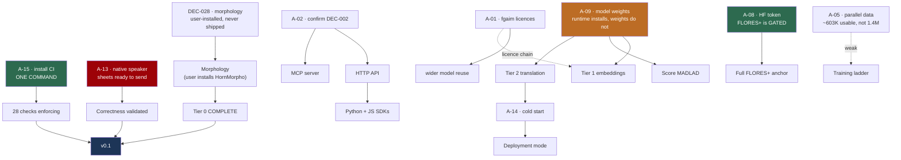

# Readiness Plan — from here to a platform people can build on

| Field | Value |
| --- | --- |
| **Status** | **Plan of record** · first written 2026-08-23 · **refreshed 2026-09-02**, covering phases A–E |
| **Supersedes** | The horizon documents (`30_days` … `2_years`) as the *execution* plan. They were written before any research and remain useful as direction, not sequence |
| **Basis** | **28 decisions · 10 experiments · 16 summaries · 161 tests · 5 audits** |
| **Live handoff** | ⚠️ [`NEXT_SESSION.md`](NEXT_SESSION.md) — §12's *"nothing left to do"* was **wrong**; read that first |

---

## 1. What "ready" means

The word does too much work to leave undefined. **Three levels, each with an
exit test that can be run**, and the v0.1 tests are run below rather than
estimated.

### v0.1 — *Honest and usable*

Someone outside this project can install it, call it, get correct Tigrinya
output, and know what they are getting.

| Exit criterion | State | Blocked by |
| --- | --- | --- |
| **Every MVP capability has a metric** | ✅ **MET** — no `TBD` left in an MVP row | — |
| **Install-to-first-call** | ✅ **MET** — `pip install` and a working call in the README | — |
| Tier 0 complete | ⚠️ **4 of 4 built, 3 of 4 usable out of the box** — morphology needs an analyser the user installs | **DEC-028** *(A-07 closed)* — HornMorpho is GPL-3.0 and never bundled |
| Licensing clean | ⚠️ **partial** — bi-encoders Apache-2.0 but built on an **unlicensed base**; `fgaim` base models unstated | **A-01** |
| Rules enforce themselves | ❌ CI written, **never run** | **A-15** |
| **A native speaker has validated the output** | ❌ **instrument built and unsent** | **A-13** |

**Two of six met outright.** Tier 0 is now *built* in full and *usable* in
three-quarters — morphology works only for a user who installs a GPL-3.0
analyser themselves. The two criteria still fully open are the two that need a
person, and one of them is a single command.

### v0.5 — *Serving*

| Exit criterion | State |
| --- | --- |
| Tier 1 embeddings built and evaluated | ⚠️ **evaluation designed** (DEC-026), model unreachable — **A-09** |
| At least one model scored | ❌ **A-09** |
| HTTP API and MCP server on DEC-022's contract | ❌ **A-02** |
| Deployed, with a measured cold start | ❌ **A-14** |
| Python + JavaScript SDKs | ❌ **A-02** |

### v1.0 — *Infrastructure*

Others build on it: stable contract, versioning policy, a real evaluation suite,
and enough adoption that breaking changes are a genuine cost.

---

## 2. Where we actually are

**Built and tested — `services/primitives`:** normalisation, tokenization,
transliteration, `warmup()`, and **morphology** — an adapter over a
user-installed HornMorpho (DEC-028) that reports its absence rather than
degrading silently.

**Built and tested — `services/evaluation`:** `metrics` and `harness`
(chrF/BLEU, variety-scoped), `primitives` (six intrinsic checks, DEC-023a),
`embeddings` (six intrinsic checks plus a lexical baseline, DEC-026), and
`morphology` (five intrinsic checks that **SKIP rather than pass** when the
GPL-3.0 analyser is absent — DEC-028).

**Also built:** the native-speaker validation instrument (`validation/`, 134
items), four enforcement scripts, a **planted-failure suite** (22 cases, CI),
28 CI checks, and **two evaluation anchors** — **HornMT** (2,030 pairs,
CC-BY-4.0, news) and **TICO-19** (3,071 segments × 3 references, CC0-1.0,
COVID/medical, **variety-declared at source**), both screened on every side.

**Not built:** Tier 1 serving, Tier 2 serving, HTTP API, MCP server, SDKs, any
deployment. **Morphology is built, instrumented, and still unmeasured** — the
checks exist and their failure paths are tested against injected analysers, but
the analyser itself is never bundled, so all five report SKIP.

**Never done:** a native speaker has never seen our output. **No model has ever
been scored.** CI has never run.

### The five gaps that actually matter

✅ **These are `GAP-n`, renamed 2026-09-02 and now resolved repo-wide.** They
were `G-1…G-5`, which collided with `goals.md`'s `G-1…G-11`: **`G-4` meant
"nothing measured end to end" here and "deliver semantic search and retrieval"
there**, and this document used both senses four lines apart.

All **22 gap-meaning citations across 6 other files** were reclassified **by
hand**, one at a time. A blind substitution was never available: **13 genuine
`G-4` citations mean the goal** and would have been corrupted by it.
`scripts/check_figures.py` now fails on any `G-n` or `GAP-n` that nothing
defines, and refuses to run if its own definitions go missing.

| # | Gap | State now |
| --- | --- | --- |
| **GAP-1** | **No native-speaker validation** | ⚠️ **Unchanged in substance, but no longer blocked on design.** The instrument exists — 134 items, ~25 minutes. Every intrinsic check still catches *broken*, not *wrong* |
| **GAP-2** | **Checks that enforce nothing** | ⚠️ **Worse than first stated: 28 checks, not 14.** All written, all locally verified, **none running** |
| **GAP-3** | **Evaluation anchors are hollow** | ⚠️ **Materially better, and now two-domain.** **HornMT** (2,030 pairs, news, CC-BY-4.0) plus **TICO-19** (3,071 segments × 3 references, COVID/medical, CC0-1.0, **variety-declared at source**). Together **170× the 30-sentence sample**, 0 overlap with it. ⚠️ But TICO-19 revealed the anchors are **not variety-neutral**: HornMT is Ethiopian-consistent at 55.5% (Experiment 010), so scoring on it is scoring one standard. Full FLORES+ still **gated, not blocked** — one token (**A-08**) |
| **GAP-4** | **Nothing measured end to end** | Unchanged, and now precisely diagnosed: the runtime **installs** (PyPI is open) and the **weights cannot be fetched** (**A-09**). MADLAD's quality assumed, Tier 2 cold start assumed. Tier 1's bar is recorded (DEC-026) |
| **GAP-5** | **The MVP is incomplete by its own definition** | ⚠️ **Built and now measurable, still not closed.** `morphology.py` is implemented against a **user-installed** HornMorpho (**DEC-028**), and `tigrinya_eval.morphology` now provides five intrinsic checks, each with its failure path tested against injected analysers. A clean `pip install` still cannot analyse morphology, so all five report **SKIP** — a third state that is deliberately not a pass. The `metrics.md` row stays ❌ until an analyser is present |

---

## 3. The dependency graph

Most remaining work is gated on a person, not on engineering. **Read it for
leverage, not for order.**



⚠️ **This graph previously routed `A-01 → Tier 1 embeddings`, and that was
wrong for 25 days.** `tiroberta-bi-encoder` and `tielectra-bi-encoder` are
**Apache-2.0**; A-01's own text said so in parentheses.

⚠️ **And that correction was itself incomplete — amended 2026-09-01.** It was
right about the *declared* licence and silent on the *chain*: the bi-encoder's
card says it is built on `fgaim/tiroberta-base`, which carries **no licence at
all**. A fine-tune's Apache-2.0 header does not license the weights it started
from. So **A-01 does reach Tier 1**, as the dotted edge above — a provenance
question, not a blocker on the bi-encoder's own tag. Correcting a dependency
error by loosening it too far is its own failure mode.

---

## 4. Phase 0 — Unblock (mostly not me)

Ordered by **leverage per minute of your time.**

| # | Action | Your effort | Unlocks |
| --- | --- | --- | --- |
| **0.1** | **A-15 — install CI** | **One command** | **28 checks** start enforcing |
| **0.2** | **A-13 — send the sheets** | Find a speaker; **~25 min of theirs** | **GAP-1 — whether any of our Tigrinya is correct** |
| **0.3** | **A-02 — confirm DEC-002** | Read a 3-min summary, decide | The entire API/MCP/SDK surface |
| **0.4** | **A-09 — a way to fetch model weights** | Config change | ⚠️ **Re-scoped:** the runtime installs from PyPI and *reading* about models is open. This is now only the weights — scoring anything at all (**GAP-4**), Tier 1, Tier 2, A-14 |
| **0.5** | **A-08 — set an `HF_TOKEN`** | **Two minutes** | ⚠️ **Upgraded:** FLORES+ is a *gated* repo, not an egress casualty. The token buys the full 997/1,012 devtest — the real fix for **GAP-3** |
| ~~0.6~~ | ~~A-07 — decide morphology's licence position~~ | ✅ **done** | Resolved by **DEC-028** — no longer yours |
| **0.7** | A-01 — email `fgaim` | Send a drafted email | DEC-003's wider reuse — and ⚠️ **the bi-encoders' licence chain**, which does touch Tier 1 |
| 0.8 | A-05 — establish terms for the mined corpus | Read OPUS/NLLB terms | ⚠️ **Downgraded twice.** Re-uploaded OPUS NLLB bitext; **experiment 009 found 56.9% of its rows have no English side at all**, so the prize is **~603K pairs, not 1.4M**. A published fine-tune on this pool scored chrF **4.99** |

```bash
# 0.1 — do this one first
mkdir -p .github/workflows && git mv ci/verify.yml .github/workflows/verify.yml
git commit -m "Activate CI verification workflow (DEC-018)" && git push
```

**A-03, A-04, A-06, A-10, A-11, A-16** run in parallel whenever convenient.
(**A-17** is closed; **A-08** was promoted into the table above.) **A-03 is an ecosystem obligation we have been sitting on** — a
confirmed contamination finding in someone else's dataset, still unreported.

### A-13 — what to send

`validation/PROTOCOL.md` and `validation/sheets/`. **134 items, ~25 minutes.**
⚠️ **Never send `validation/key.json`** — it records which answer is ours, and
sheet 1's design depends on the reviewer not knowing.

| Sheet | What it settles |
| --- | --- |
| **1 · which is right** | **The word-final `ɨ`** — experiment 005 found two forms differing on 4.53% of tokens and could not tell which is correct → **DEC-025** |
| 2, 4 · readings | Are the phonemes right at all? DEC-007 records that we cannot detect systematic `tir-Ethi` errors |
| 3 · spelling variants | Does collapsing ፀ→ጸ read as a **correction** of how someone chose to write? |
| 5 · variety | Eritrean, Ethiopian, or mixed — testing DEC-010 |

**If they have ten minutes, sheet 1 is the one.** It answers a question nothing
else can, and the answer changes shipped code.

**Offer to pay.** Expert judgement in a low-resource language is scarce and
routinely extracted for free.

---

## 5. Phase 1 — Correctness foundation (blocked on A-13)

**Nothing should ship user-facing before this.** DEC-007: *"Native-speaker
validation is required before anything ships user-facing."*

| Step | Deliverable | State |
| --- | --- | --- |
| ~~1.1~~ | Validation set — 134 items, 5 strata | ✅ **DONE**, reproduces byte-identically across hash seeds |
| ~~1.2~~ | Review protocol + `analyse.py` | ✅ **DONE**, forced choice with the answer hidden |
| 1.3 | **Measured accuracy** for transliteration and normalisation | Waiting on A-13 |
| 1.4 | **Resolve the `ɨ` question** → DEC-025 | Waiting on A-13 |
| 1.5 | **Variety audit** of the evaluation anchors | Waiting on A-13 |

**Everything from 1.3 down waits on one person's ~25 minutes.**

---

## 6. Phase 2 — Complete Tier 0 (**built**; blocked on measurement, not licence)

| Step | Deliverable | Notes |
| --- | --- | --- |
| ~~2.1~~ | HornMorpho licence resolved | ✅ **DONE** → **DEC-028**. It is **GPL-3.0**; adopted as a **user-installed** dependency we never distribute. `fgaim` POS models were rejected as *worse* — they state no licence at all |
| ~~2.2~~ | `morphology.py` behind the existing stub API | ✅ **DONE** 2026-09-02. Adapter over a user-installed HornMorpho; word-level spans per DEC-023; **16 tests, no GPL dependency present** — the analyser is injected |
| 2.2b | ⚠️ **Never package or image it** | DEC-028(c). CI check added; a hosted API may still call it, because HornMorpho is **GPL-3.0, not AGPL** |
| 2.3 | **Intrinsic checks extended to morphology** | ⚠️ **Needs an actual install** — consistency and coverage are measurable, but only with an analyser present. The `metrics.md` row stays ❌ until then |
| 2.4 | Gold data for morphological accuracy | The **one** capability DEC-023 could not free from annotation |

⚠️ **Do not repeat the `metrics.md` error.** That row claimed morphology was
validated, citing an experiment that never tested it. An audit caught it.

---

## 7. Phase 3 — The surface (blocked on A-02)

| Step | Deliverable | State |
| --- | --- | --- |
| 3.1 | Endpoint surface designed → **DEC-027** | The *contract* is decided (DEC-022); only the surface is open |
| 3.2 | HTTP API over the libraries | **Thin wrapper** — DEC-012 forbids logic behind a network call |
| 3.3 | `warmup()` at boot | ✅ **built** — lazy loading defers 3.03 s onto the first caller |
| ~~3.4~~ | Contract conformance tests | ✅ **DONE** — reads DEC-022 and fails if a clause is added and not implemented |
| 3.5 | MCP server, same libraries | Uncertainty must be **structurally** visible: a model cannot evaluate Tigrinya, and neither can its reader |
| 3.6 | Python + JS SDKs | **JS must handle the UTF-16 divergence** — Extended-B is above the BMP |
| 3.7 | Versioning policy | Cheap now, expensive once consumers exist |

---

## 8. Phase 4 — Tiers 1 and 2 (blocked on A-09)

| Step | Deliverable | State |
| --- | --- | --- |
| ~~4.1~~ | Design embeddings evaluation | ✅ **DONE** → **DEC-026**. Six properties, plus a lexical floor: the baseline scores **0.2232** on orthographic invariance against a **0.80** floor, so the neural model has a specific job |
| 4.2 | Tier 1 built and evaluated | The bar is recorded; running it is one script |
| 4.3 | **Score MADLAD-400-3B** | Closes **GAP-4** |
| 4.4 | Convert to CTranslate2 int8 (DEC-014) | |
| 4.5 | **Measure Tier 2 cold start** → closes A-14 | Experiment 006's method applies unchanged |
| 4.6 | Deployment mode from measured duty cycle | DEC-019 states the rule; A-14 supplies the number |

⚠️ **Goal G-4 — semantic search and cross-language retrieval — is unreachable
with the adopted model.** `tiroberta-bi-encoder` is monolingual. Serving it needs
a **different model class**, an undecided Tier 1 scope question (DEC-026). *(This
is `goals.md`'s G-4, not GAP-4 above — the collision the note in §2 describes.)*

⚠️ **"If MADLAD underperforms, A-05 is the only remedy" no longer holds.**
Experiment 009 measured the remedy: **56.9% of the 1.4M rows have no English
side**, the corpus is sorted so any prefix flatters it, and a published
fine-tune on that pool scored **en→ti chrF 4.99**. The insurance policy is worth
about a fifth of its stated face value, and **MADLAD has to be good enough as
shipped** — which nothing has yet measured (**A-09**).

---

## 9. Phase 5 — Ship

| Step | Deliverable |
| --- | --- |
| 5.1 | Deployment target chosen (needs A-14 + A-02) |
| 5.2 | Container images, sized against the 3.03 s cold start |
| 5.3 | Monitoring — **cheapest adequate**, not most complete |
| 5.4 | Install-to-first-call, tested on someone who has never seen the repo |
| 5.5 | Release and versioning; unversioned until a service deploys |
| 5.6 | Announce to GeezLab / L3S (**A-10**) |

---

## 10. Delivered since this plan was written

**Nineteen items, all unblocked work.** Every one found a defect, which is the
argument for the next audit rather than a claim of thoroughness.

**The through-line of phases A–E:** the register described a world that had
stopped being true. Five actions were waiting on emails whose answers were
public; two blockers were one blocker each; the corpus at the centre of the
longest-running Blocking item turned out to be **57% empty**; and the variety
gate had been reporting a number that pointed the wrong way. Nothing here
required permission — only re-testing an assumption nobody had re-tested.

| Item | What it produced |
| --- | --- |
| **Validation instrument** (1.1, 1.2) | 134 items; A-13 becomes "send these sheets". First E1-style design flaw caught: the instrument was **not reproducible** until a hash-order tie-break was added |
| **Gap audit** — 7 dimensions | **12 findings**, including a **live shipping bug**: `confidence_interval=False` returned an **inverted interval** (`ci_low > ci_high`) |
| **Assumptions re-audit** | All 10 re-audited. **A-002 said `Unvalidated` while its own body said "CONFIRMED by measurement"**; the deferred list still called the project licence open six days after DEC-020 closed it |
| **Doc-tree audit** | **"384/384, zero gaps"** was wrong — real phoneme coverage is **310/384**. NLLB listed without its **CC-BY-NC-4.0** constraint, in the document you consult when choosing a model |
| **Contract conformance suite** | Reads **DEC-022 itself** and fails if a clause is added and not implemented. Found `warnings` serialised as a tuple, so the payload was **not equal to its own JSON round-trip** |
| **Definition consistency check** | `is_ethiopic` exists **five times, two were wrong** — `experiments/002` omitted Extended-B exactly as `screen_dataset` had |
| **Experiment 007** — harness fidelity | Harness is **bit-identical** to raw sacrebleu. Found that **confidence intervals stop widening below n≈5** → DEC-009 Amendment 1 |
| **Experiment 008** — embedding baseline | A free lexical encoder **passes the mechanical properties and fails orthographic invariance at 0.2232** |
| **Embeddings evaluation** → DEC-026 | Six properties measurable without annotation; **found the A-01 → Tier 1 dependency error** |
| **This refresh** | Made this document's own headline numbers checkable — its `Basis` line matched no registered pattern, so nothing verified them. Immediately caught **"six decisions carry amendments"** when the answer is five. Then found the dates |
| **Date correction** (A-17) | **257 corrections across 56 files.** Recomputing the intervals found one wrong by a factor of six *independently of the drift* — "DEC-008 spent three months as policy", in eleven places, when the record says 15 days |
| **Phase A — HornMT ingested** | The project's **first cleanly-licensed parallel corpus**: 2,030 pairs, CC-BY-4.0, 68× the old anchor. Retracted **"0 cleanly-licensed parallel sentences"** from nine places. Found that screening **could not see the Latin half of a parallel corpus**, and that `flores_en.json` had been recording `BLOCKED` over one `ğ` |
| **Phase B — the record re-measured** | Five actions described a world that had changed. **A-07's licence is answered** (HornMorpho is **GPL-3.0**, verified from `LICENSE.txt`); **A-09 was one action covering two blockers**; **A-08 guards a gate, not a rate limit**; **A-05 is re-uploaded OPUS bitext**; **A-01 reaches Tier 1 through the chain** |
| **Phase C — three decisions** | **DEC-028** morphology is user-installed and never distributed (a hosted service *may* use it — GPL, not AGPL); **DEC-029** anchors v2, HornMT primary and TiQuAD out; **DEC-030** parallel data is clean/quarantined/refused, and **licence is identified at source** |
| **Morphology built** | `morphology.py` implements DEC-028 — **16 tests, no GPL dependency present**, the analyser injected. Reading HornMorpho's source found two traps it now defends against: `hm.analyze()` returns **`None`** when a language fails to load, and **language data is a separate download**, so `import hm` proves nothing |
| **Phase E — TICO-19 ingested** | A **second** clean anchor: 3,071 segments × 3 references, CC0-1.0 at source, and the only reachable corpus that **declares its variety**. Found two defects in the screening gate — `×` classified as a decoding failure, and corruption being decided per character when `ዘñዘሮን` and `Vò፥` are opposite verdicts |
| **Phase E — experiment 010** | The variety gate scored a **declared-Ethiopian** corpus at **91–95% "Eritrean"**. Two of three pre-committed hypotheses **refuted**. **HornMT's README read its own numbers backwards** — 55.5% of its segments carry an Ethiopian-only marker. DEC-010 Amendment 1; **A-13 re-briefed** |
| **Phase E — morphology instrumented** | Five intrinsic checks, every failure path tested against injected analysers. The finding was the *design*: a missing optional analyser must report a **third state**, not a pass, or the `metrics.md` row flips to ✅ on a machine where morphology never ran. Added `SKIP`, `MEAS`, and `IntrinsicReport.complete` |
| **Phase D — experiment 009** | The blocker was not real: the HF **Dataset Viewer** serves rows the download API will not. **56.9% of the "1.4M parallel sentences" have no English side**, the corpus is sorted by similarity, and targets repeat. **A-05 → Medium**, DEC-030 Amendment 1. H3 (column desync at lag 26) **refuted by its own threshold** on two data points — and the threshold was not moved |

### ✅ The dates in this record were wrong — and are now fixed

Auditing this refresh's own timestamp found that **every document date written
between 2026-08-21 and 2026-08-23 said `2026-08-19`** — six commits of work
stamped with the previous session's date. Measuring it found the habit was far
older:

| | |
| --- | --- |
| **Stamps earlier than their own commit** | **71**, across 34 files |
| **Worst gap** | **15 days** |
| **Ten of the 16 summaries, and eleven reports** | dated 2026-08-03, committed on the 17th and 18th |

**A-17 settled the rule: the commit date wins** — it is the only one of the two
that cannot be typed wrong. **257 corrections across 56 files**, and every
`DEC-NNN` date mention now agrees with that decision's own record.
`scripts/check_dates.py` holds the count at **0**.

This was load-bearing, and recomputing the intervals proved it. **One claim was
wrong by a factor of six, independently of the drift**: *"DEC-008 spent three
months as policy with no mechanism"* appeared in **eleven places**, and the real
interval is **15 days** — three months was never possible in a repository whose
first commit is 2026-07-29.

| Claim | Was | Is |
| --- | --- | --- |
| DEC-008 without a mechanism | three months | **15 days** |
| DEC-022 clause 5 unimplemented | 16 days | **5 days** |
| Assumptions register frozen | three weeks | **25 days** |
| README claimed no licence chosen | sixteen days | **six days** |
| `A-01 → Tier 1` dependency error | three weeks | **25 days** |
| "384/384, zero gaps" left standing | three weeks | **25 days** |
| `is_ethiopic` missing Extended-B | three weeks | **19 days** |

⚠️ **None of these changed a conclusion.** Every one of them is an argument
about how long something went unnoticed, and each is *stronger* stated
correctly — "unenforced policy is ignored within a fortnight" needs no
exaggeration.

**Cross-cutting debt table: empty.** Every item on it is done, the 71 stamps
included.

---

## 11. Risks that would invalidate this plan

| Risk | Impact | Mitigation |
| --- | --- | --- |
| **No Tigrinya speaker is found** | **Severe** — v0.1 unreachable; correctness can never be claimed | The instrument is ready. This has the longest lead time of anything here |
| **Our anchors are one variety** | **Severe, and newly visible** — DEC-004 commits to both standards, but **55.5% of HornMT's segments carry an Ethiopian-only marker** (Experiment 010) while TICO-19's Eritrean side carries **none in 3,071**. A model tuned against the primary anchor is tuned toward one standard, and DEC-010's no-aggregate rule cannot fix a *corpus* that is skewed | TICO-19 gives a variety-declared counterweight on both sides. **A-13 now asks the speaker to rule on this specifically** |
| **MADLAD is poor at Tigrinya** | **Severe** — the translation tier fails | Unknown until 4.3. **The single largest unmeasured assumption** |
| A-05 refused | Training ladder permanently blocked | ⚠️ **Much less load-bearing than it looked.** Experiment 009: **56.9% of the rows are not pairs**, the corpus is sorted, targets repeat, and a published fine-tune scored chrF **4.99**. MADLAD must be good enough as shipped either way |
| Model weights stay unfetchable | Tier 1 **and** Tier 2 impossible; **nothing is ever scored** | The runtime installs and the licences are readable, so everything except running a model can proceed |
| A-01 refused | Wider reuse narrows | ⚠️ **Does not affect Tier 1** — the bi-encoders are already clear |
| CI never installed | The whole verification apparatus is decorative | One command |

---

## 12. What I can do without you

⚠️ **Superseded 2026-09-03 — this said "Nothing" and it was wrong.**
See [`NEXT_SESSION.md`](NEXT_SESSION.md), which is the live handoff.

> **Nothing. This list is empty for the first time.**

**What the claim missed.** Morphology measurement was recorded as blocked on
"an actual install" of HornMorpho, and nobody tested whether the install was
possible. It is: the Tigrinya language data is **158,902,071 bytes at
`media.githubusercontent.com`** — GitHub's Git LFS media host, which had never
been probed. HornMorpho's own download URL is `github.com/.../raw/...`, which
**is** 403 here, and that is almost certainly why the block was assumed.

**This is the fourth instance of the same failure** — after HornMT ("one `curl`
away the whole time"), TICO-19, and the HF Dataset Viewer. The lesson §13 draws
is mechanical and this is its fourth confirmation: *an access map is a
measurement, and measurements go stale.* The register said unreachable, so
nobody reached.

⚠️ **Note what did *not* fail here.** No check was wrong. §12 was a **conclusion
drawn from the register**, and the register was stale — exactly the shape of the
variety-gate failure recorded in DEC-010 Amendment 1, where planting could not
have helped either. **Only an external probe catches this class.**

Every item that has ever been on it is done: the validation instrument, three
audits, the conformance suite, the consistency check, four experiments, the
embeddings design, this document's own instrumentation, the date correction, the
morphology adapter, both evaluation anchors, and phases A through E.

### What an empty list actually means

**Not that the project is nearly finished.** It means the *unblocked* work has
run out, and that is a much narrower claim. Two things follow, and the second
matters more:

1. **Everything remaining needs a person.** Not more research — a person. Send
   an email, install a workflow, obtain a token, read Tigrinya. The list in §4
   is now the whole plan.
2. ⚠️ **This is the point of maximum risk of doing harm.** With nothing left to
   unblock, the temptation is to build the API surface before **A-02** says who
   it is for, or Tier 1 before **A-09** lets it be measured. That would produce
   more unmeasured artefacts, and this project's own record says what happens
   next: **nine** checks have been found that could not fail, every one written
   in good faith, none caught by review. Building blind is how the tenth gets
   written.

**So the correct next action is to wait, and the correct thing to do while
waiting is nothing.** Stopping is a real option and is being taken deliberately
rather than by default.

### The one thing I would do if forced to choose

Nothing in §4 — but if a person becomes available for **25 minutes**, it is
**A-13**, and its brief changed in phase E. It used to ask a speaker to confirm
our anchors are Eritrean. Experiment 010 showed that reading came from a broken
instrument, and the corrected evidence points the other way. The question is now
whether the **primary evaluation anchor is Ethiopian-standard** — which, if
true, means every score this project reports describes one of the two varieties
DEC-004 commits it to serving.

### What I cannot do

Send an email · install the workflow · confirm a user model · obtain a licence ·
reach a blocked host · **read Tigrinya as a speaker**.

That last one is not a tooling gap and no amount of engineering closes it.

---

## 13. Honest assessment

**The method is working.** Measurement has overturned the project's own written
claims repeatedly — DEC-007's token-efficiency rationale, DEC-023's
1,639/1,639, the 22× cost saving, "384/384 zero gaps", the CI word-count that
could not count UTF-8, and now three of the largest: **"0 cleanly-licensed
parallel sentences"** (there were 2,030, public and CC-BY-4.0 throughout),
**"1.4M parallel sentences"** (57% of them have no English side), and
**HornMT's variety** — recorded as a 74/26 Eritrean lean, and Ethiopian-consistent
at 55.5% once the instrument was calibrated against a corpus that declares its
own variety.

**Eight decisions now carry amendments** (DEC-005, 007, 009, **010**, 016, 020,
023, 030), all of them corrections the project made against itself — including
**DEC-020**, whose "no dependency imposes copyleft" basis survived only because
the one dependency on the critical path had never been read, and **DEC-030**,
whose quarantine of the 1.4M corpus rested on licence until somebody finally
looked at the content.

⚠️ **The pattern across phases A–E is worth naming, because it is not about
Tigrinya.** Every one of those was cheap to check and expensive to leave: a
`curl`, a licence file, a dataset preview. What kept them standing was not
difficulty but a **stale assumption about access** — the register said the
answer was unreachable, so nobody reached for it. The lesson is mechanical:
**an access map is a measurement, and measurements go stale.**

Phase E is the third repetition and the sharpest, because the stale assumption
was not about a *host*. TICO-19 was reachable all along; what was assumed was
that **no corpus declares its variety**, so nothing ever checked whether the
variety gate worked. It did not, for a month, on every corpus, in the wrong
direction.

**The engineering discipline is real and it is not self-congratulation:**
**nine** checks have been found that *could not fail*, every one caught by
deliberately planting a failure rather than by reading the code. **Five were in
the audit tooling itself.** The seventh: the derived-counts check matched no
phrasing used in *this document*, so the plan of record was the one file whose
headline numbers nothing verified — and it was wrong when checked. The eighth:
that same check compared **line by line**, and prose wraps, so the README's
"**24** decisions / recorded" straddled a break and could not be seen at all.
The ninth: a retraction marker suppressed claims **in both directions**, so a
`⚠️` opening the *next* paragraph exempted the claim above it — and one was
wrong behind exactly that.

**Planting is now a committed test rather than a habit** (`scripts/tests/
test_plants.py`, 22 cases, in CI). That is the response to a discipline that
depended on remembering to do it.

⚠️ **One failure in phase E could not have been caught by planting, and it is
worth separating.** The variety gate was not a test that passed regardless of
input — it never blocked anything and was never meant to. It was a *measurement*
that printed noise faithfully for a month. **Only a corpus with a known answer
could catch it**, and the project had assumed none existed. Planting protects
checks; nothing but external ground truth protects a measurement.

**The exposure is equally real, and phases A–E barely touched it.** No speaker
has validated a single output. No model has been scored. Nothing is deployed and
nothing is enforced. Five phases of work made the *record* true and moved the
*platform* very little — there are now two anchors instead of one, and morphology
has an adapter and five checks, and **none of it is measured**. The morphology
checks are the clearest case: they are written, tested, and wired into CI, where
they correctly report that they did not run.

The record's own dates were unreliable until 2026-08-24 — 71 of them — and the
audit that found it also found *"DEC-008 spent three months as policy"* repeated
in eleven places when the record says 15 days. **Both are fixed; that they
survived this long is the point.**

**A platform that is rigorous about everything except whether its Tigrinya is
correct has its priorities inverted.** That remains the honest description, and
it is why **A-13 and A-15 sit above everything else** — one needs 25 minutes of
a speaker's time, the other needs one command.
