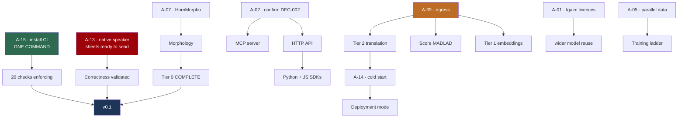

# Readiness Plan — from here to a platform people can build on

| Field | Value |
| --- | --- |
| **Status** | **Plan of record** · first written 2026-08-23 · **refreshed 2026-08-24** after eleven work items |
| **Supersedes** | The horizon documents (`30_days` … `2_years`) as the *execution* plan. They were written before any research and remain useful as direction, not sequence |
| **Basis** | **25 decisions · 8 experiments · 16 summaries · 129 tests · 4 audits** |

---

## 1. What "ready" means

The word does too much work to leave undefined. **Three levels, each with an
exit test that can be run**, and the v0.1 tests are run below rather than
estimated.

### v0.1 — *Honest and usable*

Someone outside this project can install it, call it, get correct Tigrinya
output, and know what they are getting.

| Exit criterion | State | Blocked by |
| --- | --- | --- |
| **Every MVP capability has a metric** | ✅ **MET** — no `TBD` left in an MVP row | — |
| **Install-to-first-call** | ✅ **MET** — `pip install` and a working call in the README | — |
| Tier 0 complete | ⚠️ **3 of 4** — morphology is a stub | **A-07** |
| Licensing clean | ⚠️ **partial** — bi-encoders Apache-2.0; `fgaim` base models unstated | **A-01** |
| Rules enforce themselves | ❌ CI written, **never run** | **A-15** |
| **A native speaker has validated the output** | ❌ **instrument built and unsent** | **A-13** |

**Two of six met outright, one at three-quarters.** The two that remain fully
open are the two that need a person, and one of them is a single command.

### v0.5 — *Serving*

| Exit criterion | State |
| --- | --- |
| Tier 1 embeddings built and evaluated | ⚠️ **evaluation designed** (DEC-026), model unreachable — **A-09** |
| At least one model scored | ❌ **A-09** |
| HTTP API and MCP server on DEC-022's contract | ❌ **A-02** |
| Deployed, with a measured cold start | ❌ **A-14** |
| Python + JavaScript SDKs | ❌ **A-02** |

### v1.0 — *Infrastructure*

Others build on it: stable contract, versioning policy, a real evaluation suite,
and enough adoption that breaking changes are a genuine cost.

---

## 2. Where we actually are

**Built and tested — `services/primitives`:** normalisation, tokenization,
transliteration, `warmup()`. Morphology is a deliberate stub that raises rather
than degrading silently.

**Built and tested — `services/evaluation`:** `metrics` and `harness`
(chrF/BLEU, variety-scoped), `primitives` (six intrinsic checks, DEC-023a),
`embeddings` (six intrinsic checks plus a lexical baseline, DEC-026).

**Also built:** the native-speaker validation instrument (`validation/`, 134
items), four enforcement scripts, and 20 CI checks.

**Not built:** morphology, Tier 1 serving, Tier 2 serving, HTTP API, MCP server,
SDKs, any deployment.

**Never done:** a native speaker has never seen our output. **No model has ever
been scored.** CI has never run.

### The five gaps that actually matter

| # | Gap | State now |
| --- | --- | --- |
| **G-1** | **No native-speaker validation** | ⚠️ **Unchanged in substance, but no longer blocked on design.** The instrument exists — 134 items, ~25 minutes. Every intrinsic check still catches *broken*, not *wrong* |
| **G-2** | **Checks that enforce nothing** | ⚠️ **Worse than first stated: 20 checks, not 14.** All written, all locally verified, **none running** |
| **G-3** | **Evaluation anchors are hollow** | Unchanged. One anchor unusable (TiQuAD), the other a **30-sentence sample** — and experiment 007 found confidence intervals stop being trustworthy below n≈5, which that sample's breakdowns land in |
| **G-4** | **Nothing measured end to end** | Unchanged. MADLAD's quality assumed, Tier 2 cold start assumed. **Tier 1's bar is now recorded** (DEC-026), so the measurement is a script away |
| **G-5** | **The MVP is incomplete by its own definition** | Unchanged. Morphology remains a stub (**A-07**) |

---

## 3. The dependency graph

Most remaining work is gated on a person, not on engineering. **Read it for
leverage, not for order.**



⚠️ **This graph previously routed `A-01 → Tier 1 embeddings`, and that was
wrong for 25 days.** `tiroberta-bi-encoder` and `tielectra-bi-encoder` are
**Apache-2.0**; A-01's own text said so in parentheses. **Tier 1 is blocked on
A-09 alone.** A graph that overstates a blocker makes the wrong thing look
urgent — found while designing the embeddings evaluation (DEC-026).

---

## 4. Phase 0 — Unblock (mostly not me)

Ordered by **leverage per minute of your time.**

| # | Action | Your effort | Unlocks |
| --- | --- | --- | --- |
| **0.1** | **A-15 — install CI** | **One command** | **20 checks** start enforcing |
| **0.2** | **A-13 — send the sheets** | Find a speaker; **~25 min of theirs** | **G-1 — whether any of our Tigrinya is correct** |
| **0.3** | **A-02 — confirm DEC-002** | Read a 3-min summary, decide | The entire API/MCP/SDK surface |
| **0.4** | **A-09 — a session with egress** | Config change | **Tier 1 embeddings** (nothing else blocks them), scoring MADLAD, Tier 2, A-14 |
| **0.5** | **A-05 — email re parallel data** | Send a drafted email | The training ladder; 1.4M sentences |
| **0.6** | A-07 — HornMorpho licence | One email | Morphology, completing Tier 0 |
| **0.7** | A-01 — email `fgaim` | Send a drafted email | DEC-003's wider reuse. ⚠️ **Not Tier 1** |

```bash
# 0.1 — do this one first
mkdir -p .github/workflows && git mv ci/verify.yml .github/workflows/verify.yml
git commit -m "Activate CI verification workflow (DEC-018)" && git push
```

**A-03, A-04, A-06, A-08, A-10, A-11, A-16, A-17** run in parallel whenever
convenient. **A-03 is an ecosystem obligation we have been sitting on** — a
confirmed contamination finding in someone else's dataset, still unreported.

### A-13 — what to send

`validation/PROTOCOL.md` and `validation/sheets/`. **134 items, ~25 minutes.**
⚠️ **Never send `validation/key.json`** — it records which answer is ours, and
sheet 1's design depends on the reviewer not knowing.

| Sheet | What it settles |
| --- | --- |
| **1 · which is right** | **The word-final `ɨ`** — experiment 005 found two forms differing on 4.53% of tokens and could not tell which is correct → **DEC-025** |
| 2, 4 · readings | Are the phonemes right at all? DEC-007 records that we cannot detect systematic `tir-Ethi` errors |
| 3 · spelling variants | Does collapsing ፀ→ጸ read as a **correction** of how someone chose to write? |
| 5 · variety | Eritrean, Ethiopian, or mixed — testing DEC-010 |

**If they have ten minutes, sheet 1 is the one.** It answers a question nothing
else can, and the answer changes shipped code.

**Offer to pay.** Expert judgement in a low-resource language is scarce and
routinely extracted for free.

---

## 5. Phase 1 — Correctness foundation (blocked on A-13)

**Nothing should ship user-facing before this.** DEC-007: *"Native-speaker
validation is required before anything ships user-facing."*

| Step | Deliverable | State |
| --- | --- | --- |
| ~~1.1~~ | Validation set — 134 items, 5 strata | ✅ **DONE**, reproduces byte-identically across hash seeds |
| ~~1.2~~ | Review protocol + `analyse.py` | ✅ **DONE**, forced choice with the answer hidden |
| 1.3 | **Measured accuracy** for transliteration and normalisation | Waiting on A-13 |
| 1.4 | **Resolve the `ɨ` question** → DEC-025 | Waiting on A-13 |
| 1.5 | **Variety audit** of the evaluation anchors | Waiting on A-13 |

**Everything from 1.3 down waits on one person's ~25 minutes.**

---

## 6. Phase 2 — Complete Tier 0 (blocked on A-07)

| Step | Deliverable | Notes |
| --- | --- | --- |
| 2.1 | HornMorpho licence resolved, or an alternative chosen | If refused: `fgaim` POS models (**A-01**) or a documented gap |
| 2.2 | `morphology.py` behind the existing stub API | `is_available()` already lets callers degrade gracefully |
| 2.3 | **Intrinsic checks extended to morphology** | The `metrics.md` row stays ❌ until a measurement exists |
| 2.4 | Gold data for morphological accuracy | The **one** capability DEC-023 could not free from annotation |

⚠️ **Do not repeat the `metrics.md` error.** That row claimed morphology was
validated, citing an experiment that never tested it. An audit caught it.

---

## 7. Phase 3 — The surface (blocked on A-02)

| Step | Deliverable | State |
| --- | --- | --- |
| 3.1 | Endpoint surface designed → **DEC-027** | The *contract* is decided (DEC-022); only the surface is open |
| 3.2 | HTTP API over the libraries | **Thin wrapper** — DEC-012 forbids logic behind a network call |
| 3.3 | `warmup()` at boot | ✅ **built** — lazy loading defers 3.03 s onto the first caller |
| ~~3.4~~ | Contract conformance tests | ✅ **DONE** — reads DEC-022 and fails if a clause is added and not implemented |
| 3.5 | MCP server, same libraries | Uncertainty must be **structurally** visible: a model cannot evaluate Tigrinya, and neither can its reader |
| 3.6 | Python + JS SDKs | **JS must handle the UTF-16 divergence** — Extended-B is above the BMP |
| 3.7 | Versioning policy | Cheap now, expensive once consumers exist |

---

## 8. Phase 4 — Tiers 1 and 2 (blocked on A-09)

| Step | Deliverable | State |
| --- | --- | --- |
| ~~4.1~~ | Design embeddings evaluation | ✅ **DONE** → **DEC-026**. Six properties, plus a lexical floor: the baseline scores **0.2232** on orthographic invariance against a **0.80** floor, so the neural model has a specific job |
| 4.2 | Tier 1 built and evaluated | The bar is recorded; running it is one script |
| 4.3 | **Score MADLAD-400-3B** | Closes **G-4** |
| 4.4 | Convert to CTranslate2 int8 (DEC-014) | |
| 4.5 | **Measure Tier 2 cold start** → closes A-14 | Experiment 006's method applies unchanged |
| 4.6 | Deployment mode from measured duty cycle | DEC-019 states the rule; A-14 supplies the number |

⚠️ **G-4 — cross-language retrieval — is unreachable with the adopted model.**
It is monolingual. Serving G-4 needs a **different model class**, which is an
undecided Tier 1 scope question (DEC-026).

⚠️ **If MADLAD underperforms, A-05 is the only remedy** — an email sent months
earlier, or not at all.

---

## 9. Phase 5 — Ship

| Step | Deliverable |
| --- | --- |
| 5.1 | Deployment target chosen (needs A-14 + A-02) |
| 5.2 | Container images, sized against the 3.03 s cold start |
| 5.3 | Monitoring — **cheapest adequate**, not most complete |
| 5.4 | Install-to-first-call, tested on someone who has never seen the repo |
| 5.5 | Release and versioning; unversioned until a service deploys |
| 5.6 | Announce to GeezLab / L3S (**A-10**) |

---

## 10. Delivered since this plan was written

Eleven items, all unblocked work. **Every one found a defect**, which is the
argument for the next audit rather than a claim of thoroughness.

| Item | What it produced |
| --- | --- |
| **Validation instrument** (1.1, 1.2) | 134 items; A-13 becomes "send these sheets". First E1-style design flaw caught: the instrument was **not reproducible** until a hash-order tie-break was added |
| **Gap audit** — 7 dimensions | **12 findings**, including a **live shipping bug**: `confidence_interval=False` returned an **inverted interval** (`ci_low > ci_high`) |
| **Assumptions re-audit** | All 10 re-audited. **A-002 said `Unvalidated` while its own body said "CONFIRMED by measurement"**; the deferred list still called the project licence open six days after DEC-020 closed it |
| **Doc-tree audit** | **"384/384, zero gaps"** was wrong — real phoneme coverage is **310/384**. NLLB listed without its **CC-BY-NC-4.0** constraint, in the document you consult when choosing a model |
| **Contract conformance suite** | Reads **DEC-022 itself** and fails if a clause is added and not implemented. Found `warnings` serialised as a tuple, so the payload was **not equal to its own JSON round-trip** |
| **Definition consistency check** | `is_ethiopic` exists **five times, two were wrong** — `experiments/002` omitted Extended-B exactly as `screen_dataset` had |
| **Experiment 007** — harness fidelity | Harness is **bit-identical** to raw sacrebleu. Found that **confidence intervals stop widening below n≈5** → DEC-009 Amendment 1 |
| **Experiment 008** — embedding baseline | A free lexical encoder **passes the mechanical properties and fails orthographic invariance at 0.2232** |
| **Embeddings evaluation** → DEC-026 | Six properties measurable without annotation; **found the A-01 → Tier 1 dependency error** |
| **This refresh** | Made this document's own headline numbers checkable — its `Basis` line matched no registered pattern, so nothing verified them. Immediately caught **"six decisions carry amendments"** when the answer is five. Then found the dates |
| **Date correction** (A-17) | **257 corrections across 56 files.** Recomputing the intervals found one wrong by a factor of six *independently of the drift* — "DEC-008 spent three months as policy", in eleven places, when the record says 15 days |

### ✅ The dates in this record were wrong — and are now fixed

Auditing this refresh's own timestamp found that **every document date written
between 2026-08-21 and 2026-08-23 said `2026-08-19`** — six commits of work
stamped with the previous session's date. Measuring it found the habit was far
older:

| | |
| --- | --- |
| **Stamps earlier than their own commit** | **71**, across 34 files |
| **Worst gap** | **15 days** |
| **Ten of the 16 summaries, and eleven reports** | dated 2026-08-03, committed on the 17th and 18th |

**A-17 settled the rule: the commit date wins** — it is the only one of the two
that cannot be typed wrong. **257 corrections across 56 files**, and every
`DEC-NNN` date mention now agrees with that decision's own record.
`scripts/check_dates.py` holds the count at **0**.

This was load-bearing, and recomputing the intervals proved it. **One claim was
wrong by a factor of six, independently of the drift**: *"DEC-008 spent three
months as policy with no mechanism"* appeared in **eleven places**, and the real
interval is **15 days** — three months was never possible in a repository whose
first commit is 2026-07-29.

| Claim | Was | Is |
| --- | --- | --- |
| DEC-008 without a mechanism | three months | **15 days** |
| DEC-022 clause 5 unimplemented | 16 days | **5 days** |
| Assumptions register frozen | three weeks | **25 days** |
| README claimed no licence chosen | sixteen days | **six days** |
| `A-01 → Tier 1` dependency error | three weeks | **25 days** |
| "384/384, zero gaps" left standing | three weeks | **25 days** |
| `is_ethiopic` missing Extended-B | three weeks | **19 days** |

⚠️ **None of these changed a conclusion.** Every one of them is an argument
about how long something went unnoticed, and each is *stronger* stated
correctly — "unenforced policy is ignored within a fortnight" needs no
exaggeration.

**Cross-cutting debt table: empty.** Every item on it is done, the 71 stamps
included.

---

## 11. Risks that would invalidate this plan

| Risk | Impact | Mitigation |
| --- | --- | --- |
| **No Tigrinya speaker is found** | **Severe** — v0.1 unreachable; correctness can never be claimed | The instrument is ready. This has the longest lead time of anything here |
| **MADLAD is poor at Tigrinya** | **Severe** — the translation tier fails | Unknown until 4.3. **The single largest unmeasured assumption** |
| A-05 refused | Training ladder permanently blocked | MADLAD must then be good enough as shipped |
| Egress stays blocked | Tier 1 **and** Tier 2 impossible | Everything else can proceed |
| A-01 refused | Wider reuse narrows | ⚠️ **Does not affect Tier 1** — the bi-encoders are already clear |
| CI never installed | The whole verification apparatus is decorative | One command |

---

## 12. What I can do without you

**Nothing substantial.** The date backlog that stood here is corrected — A-17
answered, 71 stamps fixed, ceiling at 0 — and it was the last unblocked item.

Everything else is finished too: validation instrument, three audits,
conformance suite, consistency check, two experiments, the embeddings design,
and this document's own instrumentation.

What remains beyond the dates is either **blocked on a person** or is work I
would rather not do blind: designing the API surface before A-02 answers who it
is for, or building Tier 1 before A-09 lets it be measured. **Unverified design
is what this project keeps getting burned by** — seven checks have now been
found that could not fail, each written in good faith and each caught only by
planting a failure.

**What I cannot do:** send an email, install the workflow, confirm a user model,
obtain a licence, reach a blocked host, or read Tigrinya as a speaker.

---

## 13. Honest assessment

**The method is working.** Measurement has overturned the project's own written
claims repeatedly — DEC-007's token-efficiency rationale, DEC-023's
1,639/1,639, the 22× cost saving, "384/384 zero gaps", and the CI word-count
that could not count UTF-8. **Five decisions now carry amendments** (DEC-005,
007, 009, 016, 023), all of them corrections the project made against itself.

**The engineering discipline is real and it is not self-congratulation:** seven
checks have been found that *could not fail*, every one caught by deliberately
planting a failure rather than by reading the code. **Three were in the audit
tooling itself** — the seventh being that the derived-counts check matched no
phrasing used in *this document*, so the plan of record was the one file whose
headline numbers nothing verified. It was wrong when checked.

**The exposure is equally real.** No speaker has validated a single output. No
model has been scored. Nothing is deployed and nothing is enforced. The record's
own dates were unreliable until 2026-08-24 — 71 of them — and the audit that
found it also found *"DEC-008 spent three months as policy"* repeated in eleven
places when the record says 15 days. **Both are fixed; that they survived this
long is the point.**

**A platform that is rigorous about everything except whether its Tigrinya is
correct has its priorities inverted.** That remains the honest description, and
it is why **A-13 and A-15 sit above everything else** — one needs 25 minutes of
a speaker's time, the other needs one command.
